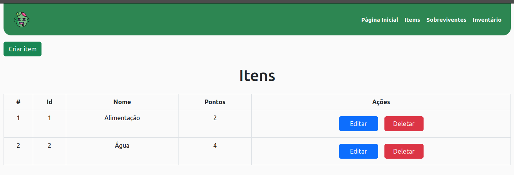
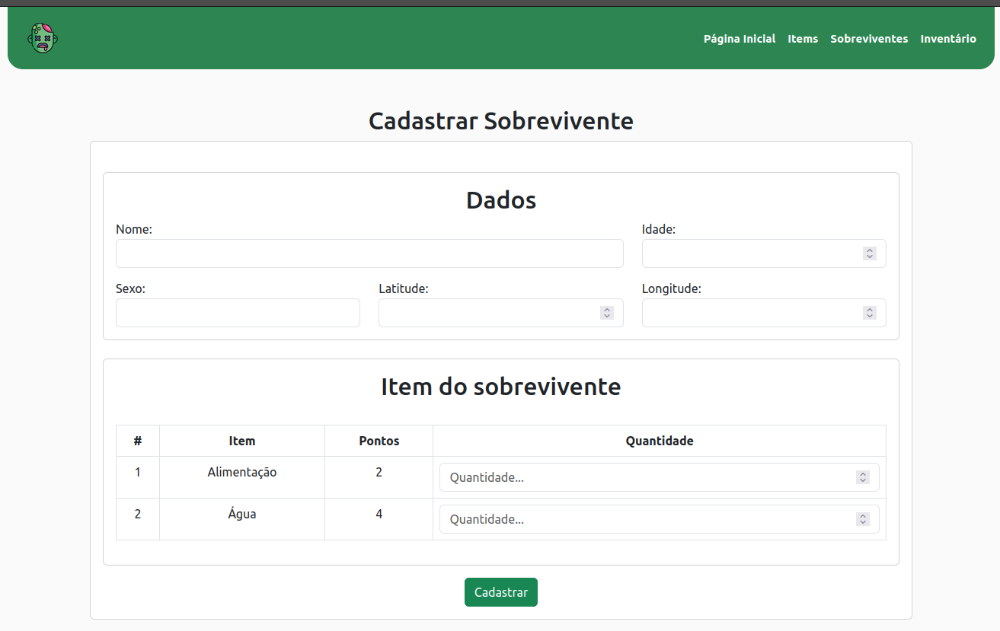
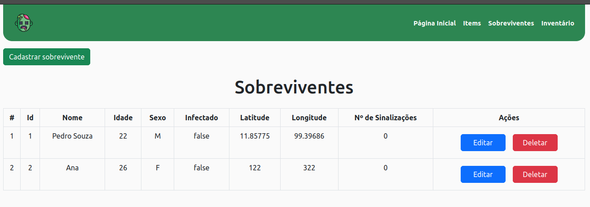

## Desafio
O mundo como o conhecemos caiu em um cenário apocalíptico. Um vírus produzido em laboratório está transformando seres humanos e animais em zumbis, famintos por carne fresca. Você, como membro da resistência aos zumbis (e o último sobrevivente que sabe codificar), foi designado para desenvolver um sistema para compartilhar recursos entre humanos não infectados.

## Exigências
 - Linguagens: Python, Css, JavaScript, Html;
 - Frameworks: Django e Django Rest;
 - Banco de dados: Postgres;
 - Controle de versões: Git;
 - Criação da interface;

## Casos de uso
 - Adicionar sobrevivente ao banco de dados;
 - Atualizar local do sobrevivente;
 - Sinalizar sobrevivente como infectado;
 - Trocar itens entre os sobreviventes;
 - Exibir relatórios;

## Regras de negócio
 - Um sobrevivente é marcado como infectado quando pelo menos outros 3 sobreviventes sinalizam sua contaminação;
 - Os sobreviventes não podem adicionar/remover itens do inventário;
 - Um sobrevivente infectado não pode negociar com outros sobreviventes;
 - Um sobrevivente infectado não pode acessa/manipular seu inventário;
 - Os pontos dos itens de troca devem ser equivalente;
 - Os itens do sobreviente deve ser declarados quando forem registrados no sistema;

## Documentação API

### Sobreviventes (representa os usuários)
 - Irá exibir uma lista contendo todos os sobreviventes:
    - __GET /survivors/__
 - Irá cadastrar um novo sobrevivente no sistema, juntamente com seus itens do inventário:
    - __POST /survivors/create/__
   ```
   {
      "name": "Bruno Cruz",
      "age": 22,
      "sex": "M",
      "latitude": 2.4344,
      "longitude": 3.434,
      "inventory": [
         {
            "id": 4,
            "amount": 2
         }
      ]
   }
   ```
 - Irá retornar detalhes do sobrevivente:
    - __GET /survivors/detail/id_survivor/__
    
 - Irá deletar o sobrevivente:
    - __DELETE /survivors/delete/id_survivor/__

### Inventários (representa o local onde estão os itens dos usuários)
 - Irá exibir uma lista contendo os inventários de todos os sobeviventes:
    - __GET /inventories/__

### Itens (representa os itens dos usuários)
 - Irá exibir uma lista contendo todos os itens cadastrados no sistema
    - __GET /items/__
    
 - Adicionar um novo item no sistema:
    - __POST /items/create/__
   ```
   {
      "name": "Alimentação",
      "point": 3
   }
   ```
 - Irá deletar o item:
    - __DELETE /items/delete/id_item/__   

## Prévia




## Projeto
 - Fazendo o clone do repositorio:
 ```
 git clone https://github.com/brunnuscz/desafio-sobrevivencia-zumbi.git
 ```
 - Entrando na pasta do projeto:
 ```
 cd desafio-sobrevivencia-zumbi
 ```
 - É preciso ter o python instalado na máquina:
 ```
 sudo apt install python
 ```
 - Para cria uma env:
 ```
 python -m venv env
 ```
 - Para ativar a env:
 ```
 source env/bin/activate
 ```
 - Instale os requisitos:
 ```
 pip install -r requirements.txt
 ```
 - Para rodas as migrations:
 ```
 python manage.py migrate
 ```
 - Por fim rode o comando:
 ```
 python manage.py runserver
 ```
